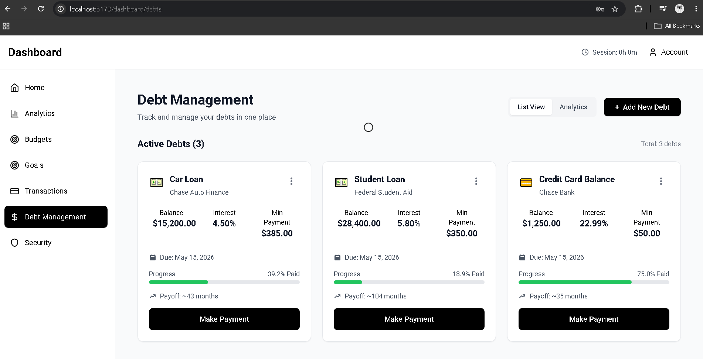
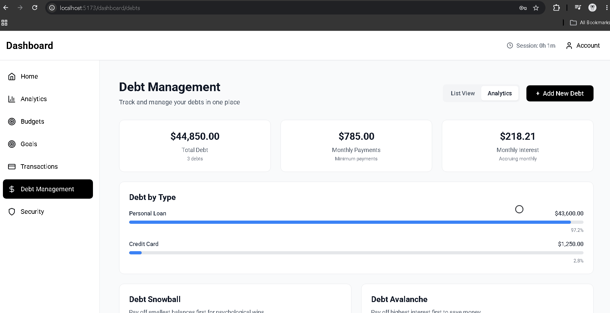

# Finance Tracker — Frontend

> A modern finance tech dashboard built with React that combines financial tracking, behavioral analytics, AI‑driven insights, and real‑time security monitoring. Designed to reflect how real‑world financial applications operate at scale.

---

## Overview

This Finance Tracker focuses on **real frontend complexity**:

* Secure authentication flows
* Advanced state management
* Real‑time updates via WebSockets
* Data‑driven financial insights
* High‑quality UI/UX with performance in mind

This frontend is built to integrate seamlessly with a security‑focused finance tech backend.

---

## Demo & Screenshots

> Screenshots reflect real application states — not mockups.

### Landing Page
* Marketing, features, benefits, "Sign Up" and "Get Started"


### Dashboard Overview


### Advanced Analytics


### Financial Goals


### Smart Budgets


### Transactions Overview


### Debt Management

<table>
  <tr>
    <td align="center">
      <br/>
      <sub><b>Active Debts Overview</b></sub>
    </td>
    <td align="center">
      <br/>
      <sub><b>Debt Analytics</b></sub>
    </td>
    <td align="center">
      <br/>
      <sub><b>Add a New Debt</b></sub>
    </td>
  </tr>
</table>

### Security Analytics


---

## Features

### Dashboard & Analytics
| Module | Description |
|--------|-------------|
| **AnalyticsPage** | Comprehensive financial overview with income/expense trends |
| **CashCompass** | AI-powered behavioral finance analysis, emotional vs impulsive spending |
| **CashFlowRadar** | Daily/weekly/monthly cash flow visualization |
| **FinanceHealthScore** | Multi-factor scoring (A-F) with actionable improvement insights |
| **IncomeExpenseChart** | Interactive charts with category breakdowns |
| **SpendingPatterns** | Pattern recognition and trend analysis |
| **MonthlyOverviewChart** | Monthly comparison and forecasting |
| **SmartSuggestions** | AI-generated personalized financial recommendations |
| **TopExpensesChart** | Highest spending categories visualization |

### Transaction Management
| Module | Description |
|--------|-------------|
| **TransactionsMain** | Main transaction hub with filtering and search |
| **TransactionsPage** | Full transaction list with CRUD operations |
| **TransactionList** | Paginated, sortable transaction display |
| **TransactionFilters** | Multi-criteria filtering system |
| **TransactionHeatmap** | Spending intensity visualization |
| **SubscriptionManager** | Recurring payment tracking and management |
| **TransactionMoodTracker** | Emotional context tagging for transactions |

### Budget Management
| Module | Description |
|--------|-------------|
| **BudgetsPage** | Budget creation, tracking, and rollover management |
| Budget limit checks | Pre-transaction validation |

### Goal Tracking
| Module | Description |
|--------|-------------|
| **GoalsPage** | Goal creation, progress tracking, auto-allocation |

### Debt Management
| Module | Description |
|--------|-------------|
| **DebtList** | All debts with balance and payment tracking |
| **DebtCard** | Individual debt summary with progress |
| **Debtform** | Add/edit debt entries |
| **DebtAnalytics** | Repayment strategies (snowball/avalanche) |
| **PaymentModal** | Payment recording interface |

### Security & Monitoring
| Module | Description |
|--------|-------------|
| **SecurityAnalyticsPage** | Login monitoring, suspicious activity, risk scoring |
| **NotificationsSummary**  | Real-time alert aggregation                         |
| **CalendarView**          | Financial calendar with due dates and events        |

### UI/UX
| Component | Description |
|-----------|-------------|
| **MagneticCursor** | Custom cursor with magnetic attraction effect |
| **HamburgerNav** | Responsive navigation menu |
| **CenteredSlider** | Smooth carousel component |
| **MultiFilter** | Advanced filtering component |
| **AlertNotification** | Toast notification system |
| **DirectionalList** | Animated list with directional reveal |

---

## Engineering Decisions & Challenges

| Decision                        | Rationale                                                        | Challenge                                                              |
| ------------------------------- | ---------------------------------------------------------------- | ---------------------------------------------------------------------- |
| Context API over Redux          | Simpler for this scale, less boilerplate                         | 9 nested providers create deep component trees and re-render cascades  |
| Provider nesting order          | Auth must be outermost, Dashboard innermost for data aggregation | Tight coupling — changing one context can break consumer dependencies  |
| Axios interceptor token refresh | Transparent token rotation without user interruption             | Request queuing logic complex; race conditions during multiple 403s    |
| Chart.js over D3                | Faster implementation for standard financial charts              | Limited customization for advanced visualizations like heatmaps        |
| Tailwind CSS utility-first      | Rapid UI development with consistent design system               | Bundle size if not purged properly; relies on PostCSS pipeline         |
| Magnetic cursor effect          | Unique UX differentiator                                         | Performance overhead on low-end devices; CSS transforms needed         |
| Client-side fallback on 404     | Graceful degradation when backend endpoints missing              | Masks actual bugs — developers might not notice broken endpoints       |
| Vite over CRA                   | Significantly faster dev server and builds                       | Ecosystem maturity — some plugins less tested than webpack equivalents |

---

## Future Improvements

- End-to-end testing — Add Playwright/Cypress tests for critical user flows
- Progressive Web App — Offline support
- WebSocket reconnection — Robust reconnection with exponential backoff and state sync
- Theme system — Dark/light mode with CSS custom properties
- Mobile-responsive pass — Optimize for tablet and phone form factors

---

## Tech Stack

| Category | Technology | Purpose |
|----------|-----------|---------|
| **Framework** | React 18 + Vite | UI framework with fast builds |
| **Routing** | React Router 6 | Client-side routing |
| **State** | Context API | Global state management |
| **Styling** | Tailwind CSS | Utility-first styling |
| **Animations** | Framer Motion | Smooth transitions and micro-interactions |
| **Charts** | Chart.js | Data visualization |
| **Icons** | Lucide React | Consistent icon system |
| **HTTP** | Axios | API requests with interceptors |
| **Real-Time** | Socket.IO Client | WebSocket connections |
| **Build** | Vite | Fast development and optimized production builds |
| **Linting** | ESLint | Code quality enforcement |

---

## Quick Start

### Prerequisites

* Node.js **18+**
* npm 
* Backend running on `http://localhost:5000`

### Installation

```bash
git clone <repository-url>
cd Finance-tracker-frontend
npm install
npm run dev
```

Application runs at: **[http://localhost:5173](http://localhost:5173)**

---

## Environment Variables

```env
VITE_API_URL=http://localhost:5000/api
VITE_WS_URL=ws://localhost:5000
```

---

## Production Build

```bash
npm run build
npm run preview
```

---

## Project Structure

```text
FINANCE-TRACKER-FRONTEND/
├── src/
│   ├── components/
│   │   ├── dashboard/              # Main dashboard modules
│   │   │   ├── AnalyticsPage.jsx
│   │   │   ├── BudgetsPage.jsx
│   │   │   ├── GoalsPage.jsx
│   │   │   ├── SecurityAnalyticsPage.jsx
│   │   │   ├── TransactionsMain.jsx
│   │   │   ├── TransactionsPage.jsx
│   │   │   ├── CashCompass.jsx         # Behavioral finance
│   │   │   ├── CashFlowRadar.jsx       # Cash flow visualization
│   │   │   ├── FinanceHealthScore.jsx  # Financial health grading
│   │   │   ├── IncomeExpenseChart.jsx
│   │   │   ├── SpendingPatterns.jsx
│   │   │   ├── SmartSuggestions.jsx
│   │   │   ├── TopExpensesChart.jsx
│   │   │   ├── MonthlyOverviewChart.jsx
│   │   │   ├── CalendarView.jsx
│   │   │   ├── RecurringTransactions.jsx
│   │   │   ├── TransactionMoodTracker.jsx
│   │   │   └── NotificationsSummary.jsx
│   │   ├── debt/                    # Debt management
│   │   │   ├── DebtList.jsx
│   │   │   ├── DebtCard.jsx
│   │   │   ├── Debtform.jsx
│   │   │   ├── DebtAnalytics.jsx
│   │   │   └── PaymentModal.jsx
│   │   ├── transactions/            # Transaction components
│   │   │   ├── TransactionList.jsx
│   │   │   ├── TransactionFilters.jsx
│   │   │   ├── TransactionHeatmap.jsx
│   │   │   └── SubscriptionManager.jsx
│   │   └── ui/                      # Reusable UI components
│   │       ├── MagneticCursor.jsx
│   │       ├── HamburgerNav.jsx
│   │       ├── CenteredSlider.jsx
│   │       ├── MultiFilter.jsx
│   │       ├── AlertNotification.jsx
│   │       └── DirectionalList.jsx
│   ├── contexts/                    # State management
│   │   ├── AuthContext.jsx
│   │   ├── SocketContext.jsx
│   │   ├── TransactionsContext.jsx
│   │   ├── AccountsContext.jsx
│   │   ├── BudgetsContext.jsx
│   │   ├── GoalsContext.jsx
│   │   ├── DebtContext.jsx
│   │   ├── TransactionMoodContext.jsx
│   │   ├── DashboardContext.jsx
│   │   └── index.jsx               # AllProviders + re-exports
│   ├── hooks/                       # Custom hooks
│   │   ├── useAuthCheck.js
│   │   ├── useDataLoader.js
│   │   ├── useErrorHandler.js
│   │   ├── useCalendarData.js
│   │   └── useSuppressedScroll.js
│   ├── pages/                       # Route pages
│   │   ├── LandingPage.jsx
│   │   ├── Login.jsx
│   │   ├── Register.jsx
│   │   └── HomePage.jsx
│   ├── services/                    # API integration
│   │   ├── api.js                   # Axios instance + interceptors
│   │   ├── analyticsService.js
│   │   ├── securityAPI.js
│   │   ├── recurringService.js
│   │   └── TransactionMoodService.js
│   ├── utils/                       # Utility functions
│   │   ├── calendarUtils.js
│   │   ├── dateUtils.js
│   │   └── moodAnalysis.js
│   ├── styles/
│   │   └── global.css
│   ├── App.jsx                      # Root component
│   └── main.jsx                     # Entry point
├── public/                          # Static assets
├── tailwind.config.js
├── vite.config.js
└── package.json
```

---

## System Architecture

### High-Level Overview
```text
┌─────────────────────────────────────────────────────────────────────┐
│ Finance-Tracker-Frontend (Port 5173)                                │
│                                                                     │
│ ┌───────────────────────────────────────────────────────────────┐   │
│ │ CONTEXT PROVIDER HIERARCHY                                    │   │
│ │                                                               │   │
│ │ AuthProvider ──> SocketProvider ──> TransactionsProvider      │   │
│ │ └─> AccountsProvider ──> BudgetsProvider ──> GoalsProvider    │   │
│ │ └─> DebtProvider ──> TransactionMoodProvider                  │   │
│ │ └─> DashboardProvider (Aggregates all data)                   │   │
│ └───────────────────────────────────────────────────────────────┘   │
│                                                                     │
│ ┌──────────────┐ ┌──────────────┐ ┌──────────────────────────┐      │
│ │ Pages        │ │ Dashboard    │ │ Specialized Modules      │      │
│ │ Login        │ │ Components   │ │ Debt Tracker             │      │
│ │ Register     │ │ - Analytics  │ │ Transaction Mood         │      │
│ │ Landing      │ │ - Budgets    │ │ Subscription Manager     │      │
│ │ HomePage     │ │ - Goals      │ │ Calendar View            │      │
│ └──────────────┘ │ - Security   │ └──────────────────────────┘      │
│                  └──────────────┘                                   │
│                                                                     │
│ ┌───────────────────────────────────────────────────────────────┐   │
│ │ SERVICE LAYER                                                 │   │
│ │ api.js (Axios + Interceptors)    │ Socket.IO Client           │   │
│ │ analyticsService.js              │ securityAPI.js             │   │
│ │ recurringService.js              │ TransactionMoodService.js  │   │
│ └───────────────────────────────────────────────────────────────┘   │
└─────────────────────────────────────────────────────────────────────┘
│
HTTP/HTTPS + WebSocket (WSS)
│
┌─────────────────────────────────────────────────────────────────────┐
│ Finance-Tracker-Backend (Port 5000)                                 │
│ Express API + Socket.IO Server + Prisma + PostgreSQL                │
└─────────────────────────────────────────────────────────────────────┘
```
## State & Data Flow Architecture

```text
User Interaction → React Component → Context Provider → API Service
            │
┌───────────┴───────────┐
│ Axios Interceptor     │
│ ├─ Attach JWT         │
│ ├─ Handle 403         │
│ ├─ Token Refresh      │
│ └─ Retry Queue        │
└───────────┬───────────┘
            │
HTTP Request → Backend API
            │
┌───────────┴───────────┐
│ Response Interceptor  │
│ ├─ Return Data        │
│ └─ Error Handling     │
└───────────┬───────────┘
            │
Context Provider ← State Update ← Processed Data ← JSON Response
│
▼
React Re-render → UI Update
```
### Token Refresh Flow
```text
API Call Returns 403 "Token Expired"
│
├── Is another refresh in progress?
│ ├── Yes → Queue this request, resolve when token refreshed
│ └── No → Set isRefreshing = true
│ │
│ ▼
│ POST /api/auth/refresh {refreshToken}
│ │
│ ▼
│ New Access Token Received
│ │
│ ├── Update localStorage
│ ├── Update axios defaults
│ ├── Process queued requests
│ └── Retry original request
```

### Context Provider Hierarchy

```jsx
<AllProviders>
  │
  ├── AuthProvider                    ← Foundation Layer
  │   │  Provides: user, token, isAuthenticated, login(), logout()
  │   │  Dependencies: None (root provider)
  │   │
  │   └── SocketProvider              ← Real-Time Layer
  │       │  Provides: socket connection, real-time events
  │       │  Dependencies: AuthProvider (needs userId for room joining)
  │       │
  │       └── TransactionsProvider    ← Core Data Layer
  │           │  Provides: transactions[], createTransaction(), updateTransaction()
  │           │  Dependencies: AuthProvider (needs token for API calls)
  │           │                SocketProvider (listens for real-time transaction updates)
  │           │
  │           └── AccountsProvider
  │               │  Provides: accounts[], balance data
  │               │  Dependencies: AuthProvider (API authentication)
  │               │
  │               └── BudgetsProvider
  │                   │  Provides: budgets[], checkLimit(), rollover data
  │                   │  Dependencies: AuthProvider (API authentication)
  │                   │                TransactionsProvider (transaction data affects spent amounts)
  │                   │
  │                   └── GoalsProvider
  │                       │  Provides: goals[], progress tracking, auto-allocation
  │                       │  Dependencies: AuthProvider (API authentication)
  │                       │                TransactionsProvider (contributions come from transactions)
  │                       │
  │                       └── DebtProvider
  │                           │  Provides: debts[], payment tracking, strategies
  │                           │  Dependencies: AuthProvider (API authentication)
  │                           │                TransactionsProvider (payments are transactions)
  │                           │
  │                           └── TransactionMoodProvider
  │                               │  Provides: moods[], mood analysis, correlation data
  │                               │  Dependencies: AuthProvider (API authentication)
  │                               │                TransactionsProvider (moods link to transactions)
  │                               │
  │                               └── DashboardProvider   ← Aggregation Layer
  │                                   │  Provides: aggregated analytics, health score, insights
  │                                   │  Dependencies: AuthProvider
  │                                   │                TransactionsProvider  ─┐
  │                                   │                AccountsProvider       ─┤
  │                                   │                BudgetsProvider        ─┼─ All data sources
  │                                   │                GoalsProvider          ─┤  for comprehensive
  │                                   │                DebtProvider           ─┤  analytics
  │                                   │                TransactionMoodProvider ─┘
  │                                   │
  │                                   └── <App />     ← Application renders here
  │                                        │
  │                                        ├── <Router>
  │                                        │   ├── / → LandingPage
  │                                        │   ├── /login → Login
  │                                        │   ├── /register → Register
  │                                        │   └── /dashboard/* → DashboardLayout
  │                                        │       ├── AnalyticsPage
  │                                        │       ├── BudgetsPage
  │                                        │       ├── GoalsPage
  │                                        │       ├── SecurityAnalyticsPage
  │                                        │       ├── TransactionsMain
  │                                        │       └── ...
  │                                        └── <MagneticCursor />
  │
  └─────────────────────────────────────────────────────────────────
```

### Dependency Flow Visualization


```text
FOUNDATION ──────────────────────────────────────────────────────────────
     │
     ▼
AuthProvider (token, user, auth state)
     │
     ▼
REAL-TIME ───────────────────────────────────────────────────────────────
     │
     ▼
SocketProvider (WebSocket connection, requires userId from Auth)
     │
     ▼
CORE DATA ───────────────────────────────────────────────────────────────
     │
     ├──► TransactionsProvider ──── (independent, but emits to Socket)
     │         │
     │         ▼
     ├──► AccountsProvider ─────── (independent, reads transaction data)
     │         │
     │         ▼
     ├──► BudgetsProvider ──────── (depends on transactions for spent calc)
     │         │
     │         ▼
     ├──► GoalsProvider ────────── (independent, contributions via transactions)
     │         │
     │         ▼
     ├──► DebtProvider ─────────── (independent, payments via transactions)
     │         │
     │         ▼
     └──► TransactionMoodProvider (depends on transactions for mood linking)
               │
               ▼
AGGREGATION ─────────────────────────────────────────────────────────────
               │
               ▼
DashboardProvider (consumes ALL data sources for comprehensive analytics)
     │
     │  Inputs:
     │  ├── Transactions: Income/expense totals, category breakdowns
     │  ├── Accounts: Balance summaries
     │  ├── Budgets: Spending vs limits
     │  ├── Goals: Progress percentages
     │  ├── Debts: Outstanding balances, payment schedules
     │  └── Moods: Emotional spending patterns
     │
     │  Outputs:
     │  ├── FinanceHealthScore (A-F grade)
     │  ├── CashFlowRadar data
     │  ├── SpendingPatterns analysis
     │  └── SmartSuggestions
     │
     ▼
<App /> (All components have access to all contexts)

```
### Context Responsibilities

| Context | Provides |
|---------|----------|
| AuthContext | User authentication, token management, login/logout |
| SocketContext | WebSocket connection, real-time event handling |
| TransactionsContext | Transaction list, CRUD operations |
| AccountsContext | Account data and management |
| BudgetsContext | Budget tracking, limit checks |
| GoalsContext | Goal CRUD, progress tracking |
| DebtContext | Debt management, payment tracking |
| TransactionMoodContext | Mood tagging and analysis |
| DashboardContext | Aggregated analytics across all data |

---

## API Integration

### Backend Endpoints

* Authentication: `/api/auth/*`
* Transactions: `/api/transactions/*`
* Budgets: `/api/budgets/*`
* Goals: `/api/goals/*`
* Debts: `/api/debts/*`
* Analytics: `/api/analytics/*`
* Security: `/api/security/*`
* Transaction Moods: `/api/transaction-mood/*`

---

### Error Handling

| Scenario | Handling |
|----------|----------|
| Token Expired (403) | Automatic refresh with request queuing |
| Network Error | Retry with exponential backoff |
| Rate Limited (429) | Auto-retry after delay (up to 2 retries) |
| Validation Error (400) | User-friendly error display |
| Not Found (404) | Graceful fallback with empty/default data |
| Server Error (500) | Error boundary with retry option |

---

## Environment Variables

```env
VITE_API_URL=http://localhost:5000/api
VITE_WS_URL=ws://localhost:5000
```

---

## Performance Optimization

* Route-based code splitting via React Router lazy loading
* Vite for fast HMR and optimized production builds
* Tailwind CSS with JIT mode for minimal CSS output
* Axios interceptors prevent redundant API calls during token refresh
* Context optimization to prevent unnecessary re-renders

---

## Security Considerations

* JWT Management: Automatic refresh, secure storage in localStorage
* Token Blacklist: Server-side revocation support
* Input Sanitization: Validation before API submission
* XSS Protection: React's built-in JSX escaping
* CORS: Backend-enforced origin validation
* Rate Limiting: Backend-enforced with client-side retry

---

## Development

### Available Scripts

```bash
npm run dev      # Start development server
npm run build    # Build for production
npm run preview  # Preview production build
npm run lint     # Run ESLint
```

### Code Quality

* ESLint rules for React best practices
* Fast Refresh enabled
* Type definitions for improved DX

---

## Browser Support

* Chrome 90+
* Firefox 88+
* Safari 14+
* Edge 90+

---

## Contributing

1. Fork the repository
2. Create a feature branch
3. Implement changes with tests
4. Ensure linting passes
5. Submit a pull request

---

## License

MIT License — see the `LICENSE` file for details.

---

Built by **Khalfaan Khan**
